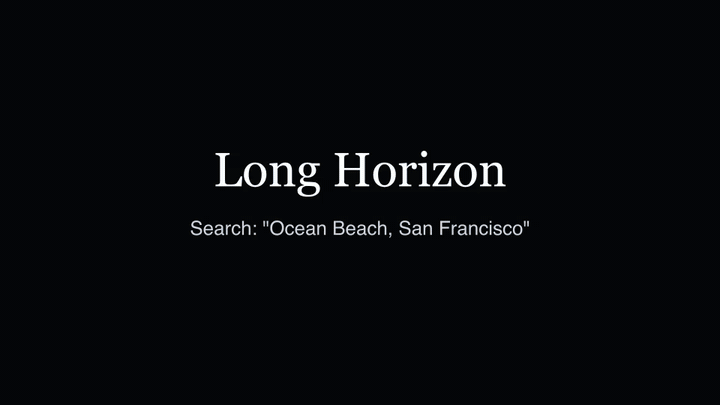
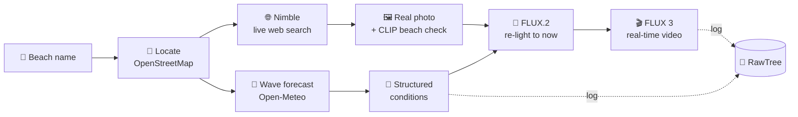

# 🌊 Long Horizon

**See the waves anywhere in the world, right now.**

Type any beach. An agent finds a real photo of it on the live web, checks the current wave forecast, adjusts the photo to match right now, and turns it into a short video.



<sub>Real output for "Ocean Beach, San Francisco" · [MP4](docs/demo.mp4) · Source photo: sanfranciscojeeptours.com</sub>

---

## How it works



1. **Locate** the beach from free text: "Kamakura japan" → coordinates.
2. **Search the live web** with Nimble for surf reports, beach descriptions and pages with photos.
3. **Read the current waves** (height, swell period, wind, weather) from the marine forecast.
4. **Find a real photo** from Nimble's pages or Wikimedia, and **verify it's a beach photo** with a local CLIP model. Logos, text cards and maps are rejected.
5. **Re-light the photo** to the current conditions with FLUX.2. The place stays exactly the same.
6. **Animate it** with FLUX 3: real speed, static camera, only the water moves.
7. **Log everything** to RawTree: raw web data, structured conditions, prompts and generation results.

## Sponsor tools

| Tool | What we use it for |
|---|---|
| **Nimble** | Live web search: surf reports, beach character, and source pages for real photos |
| **Black Forest Labs** | FLUX.2 [klein] to re-light the real photo, FLUX 3 to turn it into video (image → video) |
| **RawTree** | Stores every search: raw Nimble + forecast data, structured JSON, prompts, generation status |

Free helpers: Open-Meteo (marine forecast), OpenStreetMap Nominatim (geocoding), Wikimedia Commons (fallback photos), CLIP via transformers.js (local image check).

## Judging criteria

| Criteria | How Long Horizon answers it |
|---|---|
| **Autonomy** | One text box and nothing else. The agent searches the live web, reads live forecast data, picks and verifies a photo, writes its own prompts and generates the video. No manual steps. |
| **Self-correction** | Every step checks its own output and falls back: rejected photos → next candidate → generated image. Unknown place → retries with shorter text. Missing forecast → reads wave height from Nimble surf reports. Missing data is left out, never invented. |
| **Idea / real-world value** | Surfers and travellers want to know *"what does it look like there right now?"* Webcams exist for only a few beaches, but this works for any coastline. |
| **Technical implementation** | Next.js + TypeScript. Small single-purpose modules (`lib/*.ts`), one orchestrator route, async BFL jobs with polling, and an on-disk cache so repeat searches are instant. |
| **Tool use** | All 3 sponsor tools are in the main path: Nimble feeds data and photos, BFL makes the visuals, RawTree keeps the history. |

## 3-minute demo

1. **(0:00)** Landing page: a calm FLUX 3 ocean horizon. *"See the waves anywhere in the world."*
2. **(0:20)** Click **Ocean Beach, San Francisco** (cached, instant). Point out the real-photo credit and the live conditions.
3. **(0:50)** Type a new beach live, e.g. **"Bondi Beach Sydney"**. The re-lit real photo appears after about 10s, and the video about 45s later.
4. **(1:40)** While it renders, show the RawTree table: every search with its raw web data and structured conditions.
5. **(2:30)** The video lands. Compare it with the original photo thumbnail: same place, today's waves.

## Run it

```bash
npm install
cp .env.example .env.local   # add NIMBLE_API_KEY, BFL_API_KEY, RAWTREE_API_KEY
npm run dev                   # http://localhost:3000
```

The first start downloads the CLIP model (about 90 MB). Results are cached in `.data/` for 12 hours.

## Code map

| File | Job |
|---|---|
| `app/api/generate/route.ts` | The agent: runs the whole pipeline |
| `app/api/job/[id]/route.ts` | Polls BFL and saves finished media |
| `lib/nimble.ts` · `lib/blackforest.ts` · `lib/rawtree.ts` | Sponsor API wrappers |
| `lib/photo.ts` | Real photo search + CLIP beach check |
| `lib/openmeteo.ts` · `lib/structure.ts` | Geocoding, forecast → structured conditions |
| `lib/prompts.ts` | Conditions → image / video prompts |
| `app/page.tsx` · `components/*` | One-page UI |
